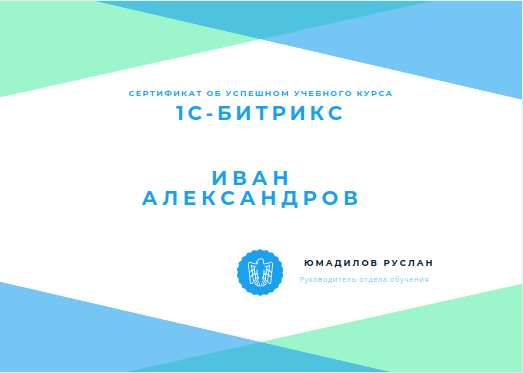

## SnegoSchool
Школа обучения профессии "разработчик 1С-Битрикс" группы компаний СНЕГ.

## Преимущества SnegoSchool
- Офлайн и онлайн обучение
- Менторинг практикующих программистов
- Возможность трудоустройства
- Нет ограничений по возрасту, образованию, уровню первоначальных знаний
- Теплая атмосфера настоящей IT компании

## Сертификат
После успешного окончания обучения и сдачи экзамена, выдается сертификат

## Трудоустройство
У всех успешно окончивших обучение есть возможность трудоустроиться в ГК СНЕГ или в компании партнеры

## Статьи о школе

## Мы в соцсетях